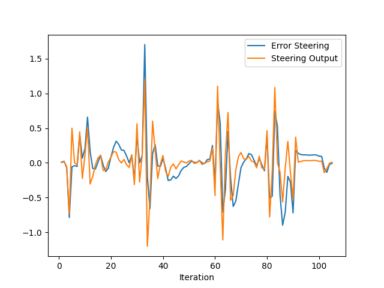
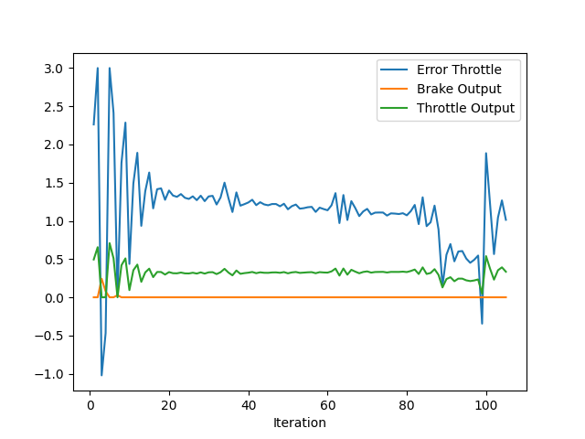

### Add the plots to your report and explain them (describe what you see)  
Hereafter are shown the plots of the steering error and the corresponding control output. The error becomes quite large in correspondance of lane direction changes, sign that the PID isn't perfectly tuned. 
  

The following plot shows the throttle error and the corresponding control output. Also in this case the controller should be further tuned to improve the results.
 

### What is the effect of the PID according to the plots, how each part of the PID affects the control command? 
PID controllers generate a control signal that is proportional to three quantities: the error commited (proportional term), its derivative (derivative term) and its integral (integral term). Each part has its specific function:
- The proportional term increases the rectiveness of the tracking;
- The derivative term helps reducing overshoots;
- The integrative term enables to compensate steady-state errors;  

### How would you design a way to automatically tune the PID parameters?
A possible solution to tune the PID parameters should be initialize them using the Zigler-Nichols method and then apply and automatic algorithm, as twiddle, to refine their values.

### PID controller is a model free controller, i.e. it does not use a model of the car. Could you explain the pros and cons of this type of controller?   
PID controllers are great as low-level control algorithm for tracking a desired signal. Indeed, they are simple to implement and the only drawback might be the initial tuning process they require. However, to generate the control signal to be tracked more coplex model-based control scheme might be necessary. For instance, model-based control algorithms enables the introduction of a feddforward term that makes the system more reactive.
